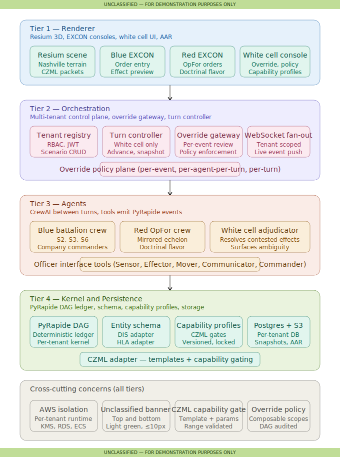

# Almighty — Architecture (v1)

> **Classification:** UNCLASSIFIED — FOR DEMONSTRATION PURPOSES ONLY

This document is a stub committed alongside the v1 architecture diagram. The
full plan and detailed component design will land via subsequent WS-NNN
issues; this page exists so that links from `README.md` and the runbook resolve.

## Four-tier overview

1. **Tier 1 — Renderer.** Resium-based 3D battlespace, EXCON consoles,
   white cell control surface, AAR replay. See WS-501 through WS-506.
2. **Tier 2 — Orchestration.** Multi-tenant control plane, tenant/scenario
   registry + RBAC, turn controller, override gateway and policy plane,
   WebSocket fan-out. See WS-301 through WS-304.
3. **Tier 3 — Agents.** Between-turn execution harness, CrewAI tool wrappers
   for officer interfaces, blue battalion / red OpFor / white cell crews.
   See WS-401 through WS-405.
4. **Tier 4 — Kernel.** PyRapide DAG with tenant/scenario namespacing, neutral
   entity/event schema, DIS/HLA adapter contracts, capability profiles,
   effect artifact taxonomy. See WS-101 through WS-108.

## Cross-cutting concerns

Per-tenant AWS isolation (WS-004), unclassified banner on every visual
surface, capability-gated CZML template library (WS-201, WS-202), override
policy plane (WS-303), live PyRapide → CZML adapter (WS-503).

## Glossary

Terminology is locked in [`glossary.md`](glossary.md) (WS-003). Every
subsequent doc and code comment that introduces an officer type, effect
family, echelon, tier, or override scope must reference the glossary
rather than redefining the term.

## Notional theater

Nashville, Tennessee — Cumberland River crossing. The Phase 2 static CZML
vignette (WS-204) and the Phase 6 integration scenario (WS-601) both build
out this slice.
